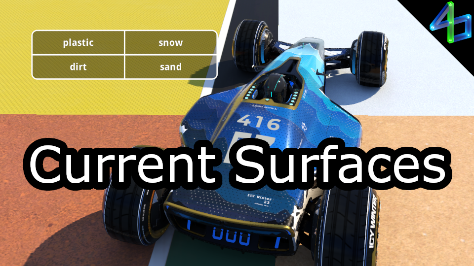

# Current Surfaces

For all 4 wheels, this shows what surface is underneath them, and therefore what physics govern them. Works for custom blocks, though it may not be totally inclusive.

Note: while spectating, most surfaces will display as road.

